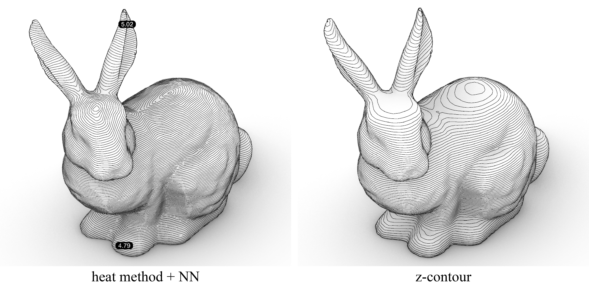
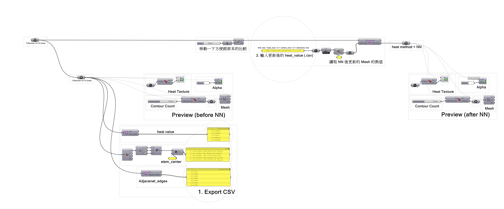
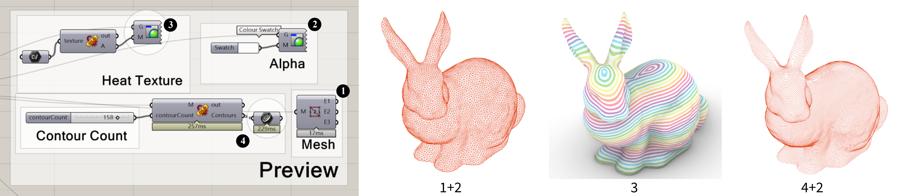

# [Geodesic Slicer](https://github.com/yunchen-lee/geodesic_slicer)



## Installation

Platform: Grasshopper + Python 3.8

### Environment Setting
```
git clone https://github.com/yunchen-lee/geodesic_slicer.git
cd geodesic_slicer
conda create --name siren-env python=3.8
conda activate siren-env
conda install pytorch==1.11.0 torchvision==0.12.0 torchaudio==0.11.0 cudatoolkit=11.3 -c pytorch
pip install tqdm numpy scipy pymeshlab pyvista tetgen trimesh einops matplotlib imageio configargparse pillow scikit-imag scikit-video h5py opencv-python cmapy tensorboard==2.14.0
```

## Usage

### Setp 0: Dataset



Datafiles (.csv) in ./data. This model can preview in Grasshopper (./gh/0717.gh).

### Step 1: NN Optimization
Run the following script to generate the optimized heat values. It will plot the loss and download the updated heat values as a .csv file.
```
python main.py
```
This neural network currently supports optimization based on two loss functions: layer uniformity and directional consistency of the gradient field.

### Step 2: Visualizetion
To view the optimized heat field, update the CSV file reference in the Grasshopper (step 2 in./gh/0717.gh). There are several ways to view the data:



## Reference
+ Liu, T., Zhang, T., Chen, Y., Huang, Y., & Wang, C. C. (2024). Neural slicer for multi-axis 3D printing. ACM Transactions on Graphics (TOG), 43(4), 1-15.
+ Sitzmann, V., Martel, J., Bergman, A., Lindell, D., & Wetzstein, G. (2020). Implicit neural representations with periodic activation functions. Advances in neural information processing systems, 33, 7462-7473.
+ Mitropoulou, I., Bernhard, M., & Dillenburger, B. (2022). Nonplanar 3D printing of bifurcating forms. 3D printing and additive manufacturing, 9(3), 189-202.
+ Crane, K., Weischedel, C., & Wardetzky, M. (2013). Geodesics in heat: A new approach to computing distance based on heat flow. ACM Transactions on Graphics (TOG), 32(5), 1-11.
+ McNeel Forum. (2020, 7). Heat Method. [https://discourse.mcneel.com/t/heat-method/105135](https://discourse.mcneel.com/t/heat-method/105135)
